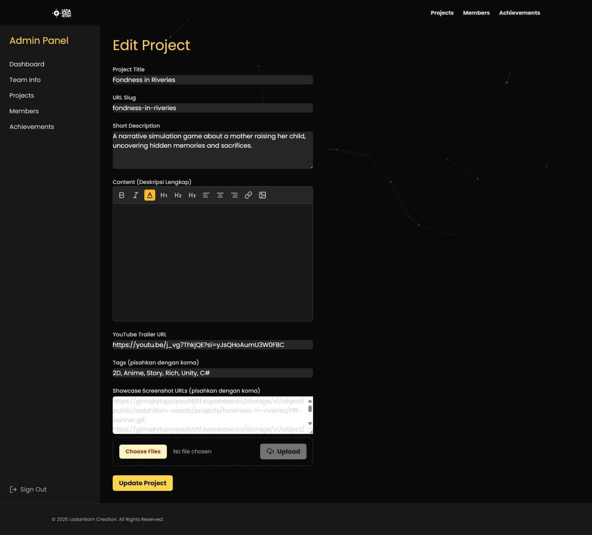

# LadaHitam Creation - Website & CMS


Technical documentation for the portfolio website and internal Content Management System (CMS) for the indie game studio, LadaHitam Creation.

## ✨ Demo

View the live website here: [**ladahitam.my.id**](https://ladahitam.my.id/)

*(Note: The admin panel is protected by a login system and is not publicly accessible).*

## 📖 Project Overview

This project is a full-stack web application built from scratch using a modern Next.js App Router architecture. Its purpose is to create two integrated experiences:

1.  **Public Site:** An immersive, fantasy-themed portfolio to showcase the studio's projects, team members, and achievements.
2.  **Internal CMS:** A secure admin panel where the team can easily manage all content displayed on the public site through a complete CRUD (Create, Read, Update, Delete) interface.

The entire application, from server-side data fetching to complex admin functionalities, is seamlessly deployed on Vercel.

## ⚙️ Core Technical Features

* **Next.js App Router Architecture:**
    * Utilizes **Server Components** for efficient and secure data fetching directly from the database (`async/await` within components).
    * Employs **Client Components** (`"use client"`) for all interactive elements, such as forms, buttons, and animations.
    * Implements **Nested Layouts** to separate the public-facing and admin interfaces.

* **Custom Content Management System (CMS):**
    * Full **CRUD** system for three primary data models: Projects, Team Members, and Achievements.
    * **Rich Text Editor:** Uses **Tiptap.js** to provide a Wordpress-like content editing experience, complete with formatting (H1-H3, bold, italic), links, text alignment, and image uploads.
    * **Secure Authentication:** The admin panel is protected by a credentials-based login system built with **NextAuth.js**, featuring a session timeout (30-minute inactivity) for enhanced security.

* **Database & Backend Integration:**
    * **Prisma ORM:** Serves as the bridge between the application and the database, ensuring type-safety across the entire project.
    * **PostgreSQL Database:** Hosted on **Supabase**, with a relational schema designed from the ground up.
    * **Supabase Storage & RLS:** Implemented a file upload system for logos and image galleries, secured with **Row-Level Security (RLS)** policies to control access (`INSERT`, `UPDATE`, `SELECT`).
    * **On-Demand Revalidation:** Uses `revalidatePath` from Next.js to instantly purge the server cache whenever data is modified via the CMS, ensuring all visitors always see the latest content.

* **Interactive & Gamified Frontend:**
    * **Dynamic Background:** Uses `tsParticles` to create an interactive particle background.
    * **3D Parallax Effect:** Project cards utilize `react-parallax-tilt` to provide a 3D effect on hover.
    * **Masonry Layout:** The team member portfolio gallery uses `react-masonry-css` to create an organic and responsive moodboard layout.
    * **Custom Animations:** Crafted with **Tailwind CSS** to provide satisfying visual feedback on interactive elements.

## 💻 Tech Stack

**Frontend:**


**Backend & Deployment:**


**Database & Services:**


## 🏗️ Architecture & Project Structure

This project follows the standard Next.js App Router structure to ensure scalability and maintainability.

```
/src
├── /app
│   ├── /api/               # Backend API Routes (Auth, CRUD)
│   ├── /admin/             # Admin-only pages & layout (protected by Middleware)
│   ├── /login/             # Login Page
│   ├── /projects/          # Public pages (List & Detail)
│   ├── /members/           # Public pages (List & Detail)
│   ├── layout.tsx          # Root Layout
│   └── page.tsx            # Homepage
├── /components
│   ├── /admin/             # Components for the Admin Panel (Forms, Buttons)
│   └── /public/            # Components for the Public Site (Cards, Gallery)
├── /lib                    # Helper code (Prisma Client, Supabase Client)
└── /prisma                 # Database Schema & Migrations
```

## 📸 Screenshots

**Homepage**


**Projects Section**


**Projects Detail Page**


**Members Detail Page**


**Admin Panel - Project Management**


## 📄 License

This project is licensed under the Apache 2.0 License. See [LICENSE](LICENSE) for details.

## 🙏 Credits

**Rifki Setiawan** 👨‍💻 Full Stack Developer & Game Programmer ([GitHub](https://github.com/rifkisetiawan0101))

---

Thanks for visiting this project repository! ✨
